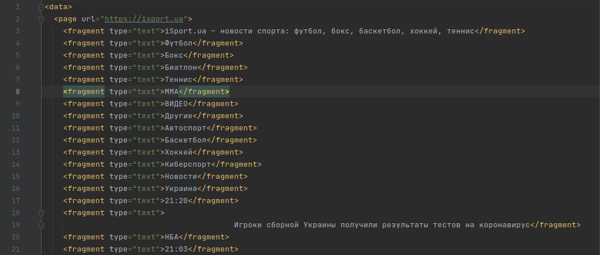
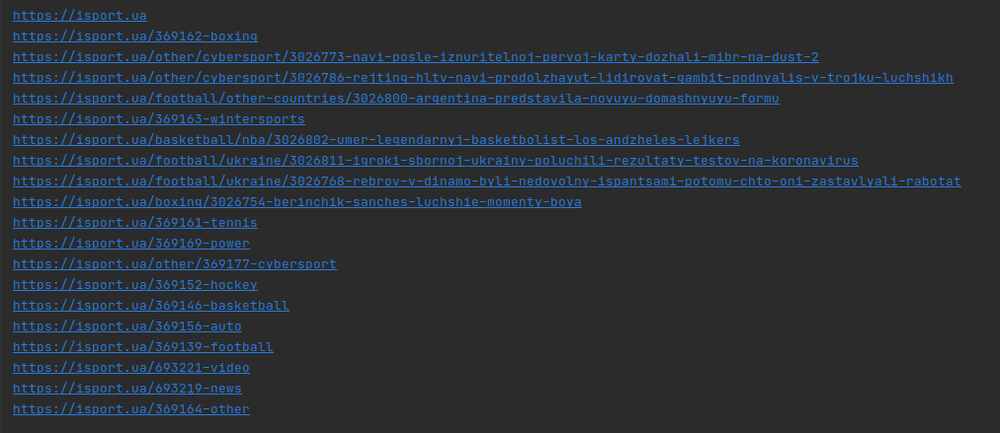
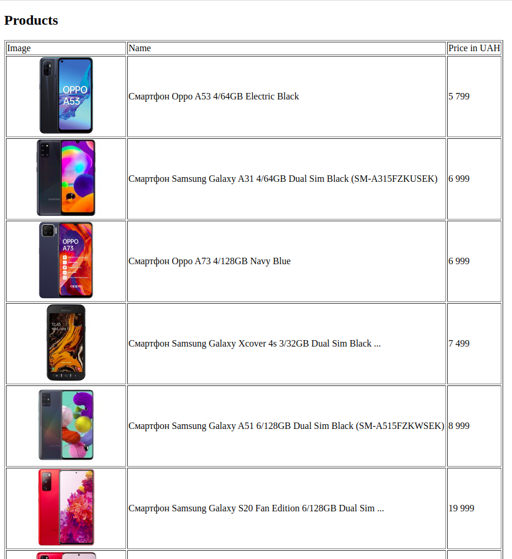

# Івахненко Маргарита КП-81

## Лабораторна робота 1: Вивчення базових операцій обробки XML-документів

## Варіант 6

|Варіант| Базова сторінка (завдання 1) | Зміст завдання 2     | Адреса інтернет-магазину (завдання 3) |
|------------------------------|------------------------------|----------------------|---------------------------------------|
|6| www.isport.ua         | Вивести список гiперпосилань | www.portativ.ua  |

## Приклади роботи програми
 

  <i><b> Crawling www.isport.ua</b></i>  
    

 

  <i><b> Links from www.isport.ua  </b></i>
    

  
 

  <i><b> Generated xhtml page by xslt  </b></i>
    

